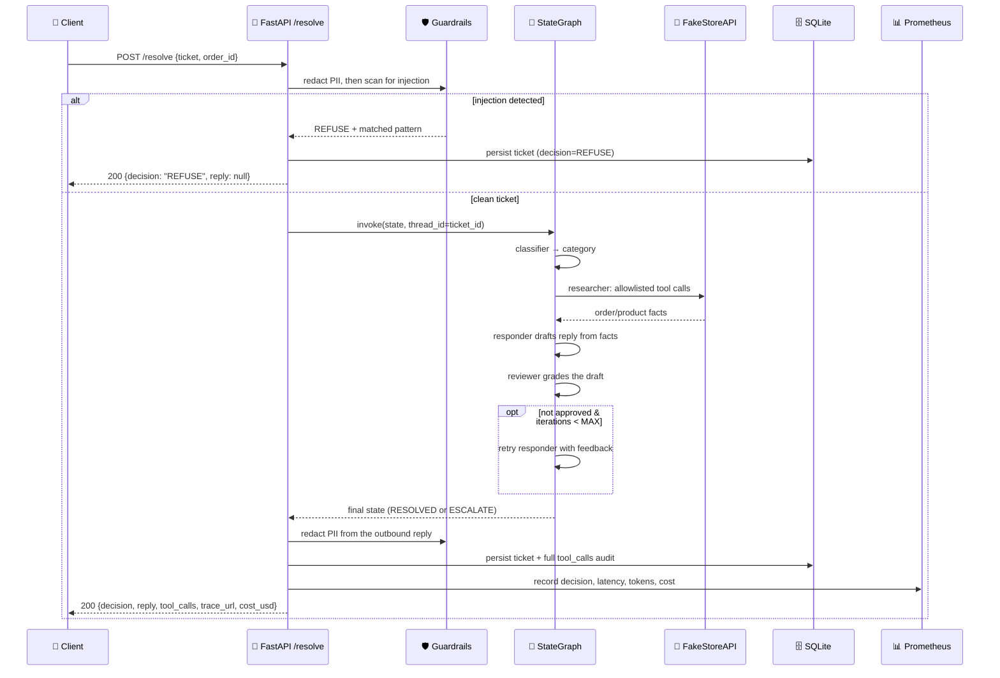
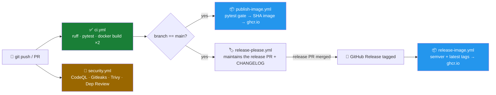

# 🚀 DeskFleet — Multi-Agent Support Ticket Resolver


[](https://github.com/sinalkar/deskfleet/actions/workflows/ci.yml)

**LangGraph + FastAPI + Streamlit · monorepo · Docker Compose · GitHub Actions → GHCR**

DeskFleet is a small, self-contained reference implementation of a **production-shaped
multi-agent system**: it takes a raw support ticket, runs it through a four-node
LangGraph `StateGraph`, and returns a fully-audited decision — with prompt-injection
defense, PII redaction, a hard security allowlist on tool calls, tracing, cost
accounting, and a live dashboard, all wired together end-to-end rather than sketched
as a notebook demo.

Every ticket that enters the system ends in exactly one terminal decision:

| Decision | Emoji | Meaning |
|---|---|---|
| `RESOLVED` | ✅ | An auto-reply was drafted, grounded in real data, and approved by the reviewer agent |
| `ESCALATE` | ⚠️ | Handed to a human, with a concrete reason (unfixable draft, or the review loop ran out) |
| `REFUSE` | ⛔ | Prompt injection or an out-of-scope request — refused **before the LLM is ever called** |

The service is traced end-to-end in LangSmith, exports Prometheus metrics, persists a
full audit trail to SQLite, and ships with a Streamlit support console so a human can
see exactly what the agents did and why.

---

## 📚 Table of contents

- [Why this exists](#-why-this-exists)
- [How a ticket flows through the system](#-how-a-ticket-flows-through-the-system)
- [The agent graph, node by node](#-the-agent-graph-node-by-node)
- [Request lifecycle, step by step](#-request-lifecycle-step-by-step)
- [Design principles that make this safe to run unattended](#-design-principles-that-make-this-safe-to-run-unattended)
- [The FakeStore mapping](#-the-fakestore-mapping)
- [Repository layout](#-repository-layout)
- [Quick start](#-quick-start)
- [Configuration](#-configuration)
- [Multi-provider LLM support](#-multi-provider-llm-support)
- [API reference](#-api-reference)
- [Testing](#-testing)
- [Observability](#-observability)
- [CI/CD pipeline](#-cicd-pipeline)
- [Seed & smoke test](#-seed--smoke-test)

---

## 💡 Why this exists

Customer support triage is a good stress test for agentic systems: it needs
**real tool use** (order/product lookups), **grounded generation** (replies must be
based on facts, not invented), **a self-check loop** (a second agent reviews the
first agent's draft), and **hard safety boundaries** (never call an arbitrary tool,
never leak PII, never take instructions embedded inside user content). DeskFleet
implements all of that as actual, tested code rather than prompt-only guardrails —
the security-critical decisions (tool allowlisting, loop bounds, injection
short-circuiting) all live in plain Python, not in something an LLM could be talked
out of.

---

## 🧭 How a ticket flows through the system


**The two guardrails run outside the agent graph entirely.** PII redaction and
injection detection are plain regex layers that execute *before* the graph is ever
invoked — a malicious or leaky ticket is neutralized by ordinary code, not by asking
an LLM nicely.

---

## 🤖 The agent graph, node by node


| # | Node | What it does | Writes to state |
|---|---|---|---|
| 1 | **🏷️ Classifier** | One LLM call buckets the ticket into a category | `category` |
| 2 | **🔍 Researcher** | Plans and dispatches tool calls — but *only* tools present in `tools/registry.py::ALLOWLIST`; anything else is logged as `status="blocked"` and never runs | `facts`, `tool_calls` |
| 3 | **✍️ Responder** | Drafts a reply grounded *only* in the accumulated `facts` — on a retry it also incorporates the reviewer's `review_feedback` | `draft` |
| 4 | **✅ Reviewer** | Grades the draft for grounding and policy compliance; returns a structured `{approved, feedback}` verdict and increments the iteration counter | `decision` or `review_feedback` |

The loop-back edge from Reviewer → Responder is the graph's one piece of real
branching, and its exit condition (`iterations >= MAX_REVIEW_ITERATIONS`) is enforced
in `graph/edges.py` — **plain routing code, never trusted to the model** — so a
model that keeps rejecting its own drafts cannot spin forever; it deterministically
becomes `ESCALATE` with the last feedback attached as the reason.

---

## 🔁 Request lifecycle, step by step



---

## 🔐 Design principles that make this safe to run unattended

- **Injection short-circuits before the model.** `guardrails/injection.py` runs on
  the raw (already PII-redacted) ticket; a match returns `REFUSE` without ever
  constructing or invoking the LLM. Tests assert **zero** model calls on an
  injection ticket.
- **PII is redacted in three places:** the inbound ticket, the outbound draft, and
  everything persisted to SQLite. `[REDACTED]` substitution is idempotent.
- **The allowlist *is* the security boundary.** Only tools registered in
  `tools/registry.py::ALLOWLIST` can execute; any other model-requested tool name is
  recorded with `status="blocked"` and dispatched to nothing.
- **The review loop is bounded in code, not by the model.** `graph/edges.py`
  enforces `MAX_REVIEW_ITERATIONS`; once exhausted the ticket deterministically
  becomes `ESCALATE`, carrying the reviewer's last feedback as the reason.
- **The LLM is dependency-injected.** Every node depends on the `LLMClient`
  protocol (`graph/llm.py`). Production wires in a configured chat model; the test
  suite injects a scripted fake — so **the entire safety test suite runs with zero
  API keys.**

---

## 🛒 The FakeStore mapping

FakeStore has no real order-status/fulfillment endpoint, so DeskFleet maps the
domain concept of an **order** onto FakeStore's `/carts` resource (the closest
analogue: it links a user to purchased products with a date).

- `get_order_status` fetches `/carts/{id}` and derives a **deterministic synthetic
  status** — `processing → shipped → in_transit → delivered`, chosen by
  `cart_id % 4` — and documents this mapping in a `note` field on the response.
- `search_products` filters the catalog client-side, since FakeStore has no native
  search endpoint.

---

## 🗂️ Repository layout

```
deskfleet/
├── apps/
│   ├── api/            🚪 FastAPI service — the deployable unit
│   │   └── src/
│   │       ├── graph/          🧠 state.py · nodes.py · edges.py · build.py · llm.py
│   │       ├── tools/          🛒 registry.py (allowlist) · fakestore.py
│   │       ├── guardrails/     🛡️ injection.py · pii.py
│   │       ├── storage/        🗄️ db.py · repo.py (SQLite)
│   │       ├── observability/  📊 metrics.py (Prometheus) · costing.py (tiktoken)
│   │       ├── schemas.py      📋 Pydantic request/response models
│   │       ├── service.py      🔁 orchestration: guardrails → graph → persist → metrics
│   │       └── main.py         🌐 FastAPI app factory + routes
│   └── ui/              🖥️ Streamlit support console
├── packages/shared/     📦 shared constants (decision enum, categories)
├── infra/               📈 Prometheus scrape config + provisioned Grafana dashboard
├── tests/               ✅ deterministic safety + contract suite — no API keys needed
├── scripts/             🌱 seed_tickets.py · smoke_test.sh
└── .github/workflows/   ⚙️ ci · security · publish-image · release-please · release-image
```

---

## ⚡ Quick start

### 1. Local (Python)

```bash
cd deskfleet
python -m pip install -r requirements-dev.txt   # api + dev deps
python -m pip install -r apps/ui/requirements.txt

cp .env.example .env    # optional: add an LLM provider key for the live flow

make api    # FastAPI on http://localhost:8080   (/health, /docs, /metrics)
make ui     # Streamlit on http://localhost:8501
```

Without a configured LLM key, `/health` reports `llm_configured: false` and the live
graph will raise on `/resolve` for non-injection tickets (by design — no silent fake
in production). Injection tickets still `REFUSE` with no key, and **the entire test
suite passes with no key** via the injected fake LLM.

### 2. Full stack (Docker Compose)

```bash
cp .env.example .env    # fill in keys
docker compose up --build
```

| Service | URL | What you'll see |
|---|---|---|
| 🚪 API | http://localhost:8080 | `/docs` (OpenAPI), `/health`, `/metrics` |
| 🖥️ Streamlit UI | http://localhost:8501 | Paste a ticket, watch it resolve live |
| 📈 Prometheus | http://localhost:9090 | Raw metrics + query explorer |
| 📊 Grafana (`admin`/`admin`) | http://localhost:3000 | Auto-provisioned **DeskFleet Overview** dashboard |

The Grafana dashboard auto-provisions the Prometheus datasource and shows
throughput, P50/P99 latency, decision breakdown, cumulative spend, escalation rate,
tokens, and tool-call counts — no manual setup.

---

## ⚙️ Configuration

All configuration flows through `apps/api/src/config.py` (pydantic-settings) — no
module reads `os.environ` directly. See `.env.example` for every variable; the
notable ones:

| Var | Default | Purpose |
|---|---|---|
| `LLM_PROVIDER` | `openai` | `openai` \| `groq` \| `gemini` \| `nvidia` \| `anthropic` \| `ollama` |
| `LLM_MODEL` | `gpt-4o-mini` | provider-specific chat model id |
| `OPENAI_API_KEY` … | — | per-provider credential (only the selected provider's key is required) |
| `LLM_BASE_URL` | — | optional endpoint override for OpenAI-compatible providers |
| `MAX_REVIEW_ITERATIONS` | `2` | review-loop bound (enforced in code, see above) |
| `MAX_TOOL_ROUNDS` | `3` | researcher tool-call cap per ticket |
| `SQLITE_PATH` | `./deskfleet.db` | audit database path |
| `LANGCHAIN_TRACING_V2` | `false` | enable LangSmith tracing — env-only, zero code changes |

---

## 🔀 Multi-provider LLM support

Switching providers is a two-line edit in `.env` — no code changes. Graph nodes
receive the model through `build_chat_model()` (`apps/api/src/graph/llm.py`) and
never know which provider is active.

| `LLM_PROVIDER` | Example `LLM_MODEL` | Key var | Extra install |
|---|---|---|---|
| `openai` | `gpt-4o-mini` | `OPENAI_API_KEY` | — |
| `groq` | `llama-3.3-70b-versatile` | `GROQ_API_KEY` | — |
| `nvidia` | `meta/llama-3.1-70b-instruct` | `NVIDIA_API_KEY` | — |
| `ollama` | `llama3.1:8b` | none (`OLLAMA_BASE_URL`) | [Ollama](https://ollama.com) + `ollama pull llama3.1:8b` |
| `anthropic` | `claude-sonnet-4-6` | `ANTHROPIC_API_KEY` | `pip install -r apps/api/requirements-providers.txt` |
| `gemini` | `gemini-2.0-flash` | `GOOGLE_API_KEY` | `pip install -r apps/api/requirements-providers.txt` |

Groq, NVIDIA NIM, and Ollama ride the OpenAI-compatible lane (`langchain-openai`
with a `base_url` swap) — zero new dependencies. Anthropic and Gemini use their
native LangChain integrations for the most reliable tool-calling and structured
output. Boot fails fast with a clear message if the selected provider's key is
missing. Costing resolves a `(provider, model)` price table; Ollama and NVIDIA NIM
report `$0`. Caveat: small local models (<8B) can be unreliable at the
structured-output steps (Classifier/Reviewer) — prefer ≥8B instruct models.

---

## 🌐 API reference

| Endpoint | Behavior |
|---|---|
| `POST /resolve` | `{ticket, order_id?}` → `{decision, reply, category, tool_calls, escalation_reason, iterations, langsmith_trace_url, latency_ms, cost_usd}` |
| `GET /health` | liveness probe; also reports `llm_configured` |
| `GET /metrics` | Prometheus scrape endpoint |
| `GET /tickets?limit=N` | last N resolved tickets from SQLite (demo/audit aid) |

```bash
curl -X POST localhost:8080/resolve -H 'content-type: application/json' \
  -d '{"ticket":"Where is my order 3?","order_id":"3"}'
```

---

## ✅ Testing

```bash
make test         # pytest tests/ -v   — NO API key required
make lint         # ruff check .
```

| Test | Guarantees |
|---|---|
| `test_allowlist` | Off-registry tool call is blocked, logged, **never executed** |
| `test_max_iterations` | Loop ends at `ESCALATE` after exactly `MAX_REVIEW_ITERATIONS` |
| `test_injection` | Injected ticket ⇒ `REFUSE` with **zero** LLM invocations |
| `test_pii` | Email/phone/SSN/card redacted in the API response **and** in the DB |
| `test_api` | `/resolve` schema, `422` on empty ticket, `/health` 200, `/metrics` |
| `test_fakestore` | Tool semantics verified against stubbed HTTP |
| `test_llm_provider` | Provider routing, missing-key errors, and per-provider costing |

---

## 📊 Observability

- **Prometheus** — `deskfleet_tickets_total{decision}`,
  `deskfleet_ticket_latency_seconds` (histogram), `deskfleet_tokens_total`,
  `deskfleet_cost_usd_total`, tool-call counters.
- **Grafana** — provisioned **DeskFleet Overview** dashboard: throughput, P50/P99
  latency, decision breakdown, cumulative spend, escalation rate.
- **LangSmith** — every node, tool call, and retry traced automatically once
  `LANGCHAIN_TRACING_V2=true`; the trace URL is returned directly in the
  `/resolve` response.

---

## ⚙️ CI/CD pipeline



| Workflow | Trigger | Purpose |
|---|---|---|
| **`ci.yml`** | every push/PR | `ruff check` → `pytest` → `docker build` of both images |
| **`security.yml`** | PRs + push to `main` | CodeQL, dependency review, Gitleaks, Trivy |
| **`publish-image.yml`** | push to `main` | re-run tests → publish immutable per-commit SHA image to `ghcr.io` |
| **`release-please.yml`** | push to `main` | maintains the release PR, `CHANGELOG.md`, version tag, GitHub Release |
| **`release-image.yml`** | GitHub Release *published* | build & push the API image to GHCR with semver + `latest` tags |

The only secret these workflows use is `GITHUB_TOKEN`, provided automatically by
GitHub — no additional repository secrets are required for CI/CD to pass.

**Runtime deployment is deliberately out of scope for the automated workflows.**
The immutable SHA image published to `ghcr.io` is the deployable artifact; roll it
out with whatever mechanism your environment uses (Cloud Run, ECS, Kubernetes, a
plain VM, …).

Releases follow [Conventional Commits](https://www.conventionalcommits.org/):
`feat:` → minor bump, `fix:` → patch bump, `feat!:`/`BREAKING CHANGE` → major bump,
`docs:`/`chore:` → no release. Merging the standing release PR tags the commit,
publishes the GitHub Release, and triggers `release-image.yml`.

### Required GitHub repository settings

- **Settings → Actions → General → Workflow permissions:** *Read and write
  permissions*, plus *Allow GitHub Actions to create and approve pull requests*
  (needed by release-please).
- **Settings → Code security:** enable *Code scanning* to receive CodeQL/Trivy
  SARIF uploads.
- **Branch protection on `main`:** require `CodeQL (Python)`, `Dependency Review`,
  `Gitleaks Secret Scan`, `Trivy Filesystem Scan`, and the CI `test` job as status
  checks.

---

## 🌱 Seed & smoke test

```bash
make api                       # in one shell
python scripts/seed_tickets.py # 5 sample tickets vs. expected decisions
bash scripts/smoke_test.sh     # curl /health + /resolve + /tickets
```

The seed tickets cover the full decision space: an order-status query →
`RESOLVED`, a refund per policy → `RESOLVED`, a prompt-injection attempt →
`REFUSE`, an out-of-scope rant → `ESCALATE`, and a product question →
`RESOLVED`.
